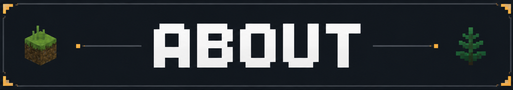
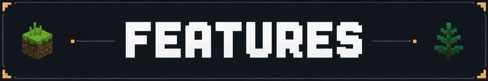
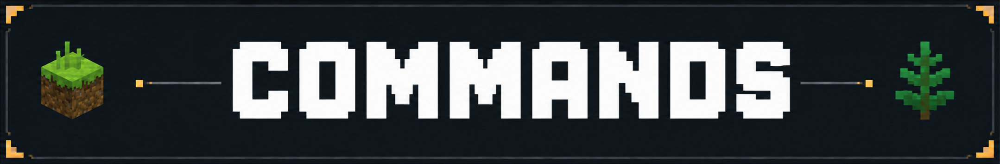
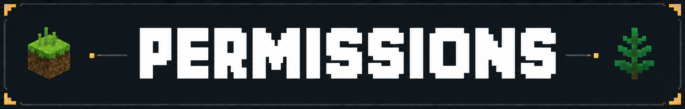
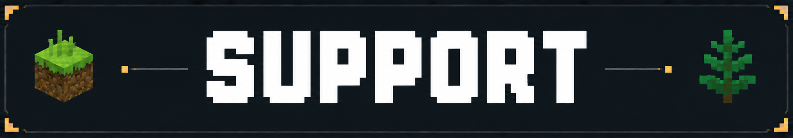
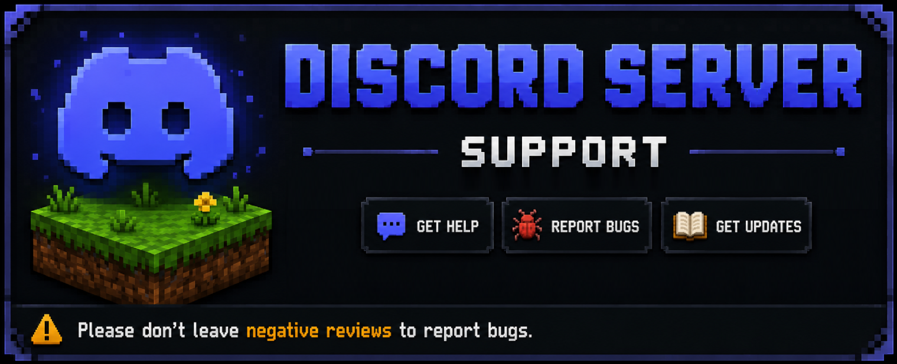

# FaunaReborn

> Turn passive farm mobs into dynamic, configurable, performance-safe hostile encounters.

FaunaReborn is a premium-style Paper/Folia plugin that transforms chickens, cows and pigs into intelligent hostile entities with environmental scaling, social alert behavior, and server-friendly safeguards.

## About



FaunaReborn is built for servers that want more tension, replayability and survival depth without replacing vanilla identity.

- Native Paper support (`1.21+` API).
- Folia-compatible architecture.
- Modular design per species (Chicken, Cow, Pig).
- Production-focused config layout with world filtering and hard safety caps.

## Key Features



### Combat AI and Provocation Systems
- **Chicken Hostility Engine** with multi-attacker control, threat decay, line-of-sight logic, and configurable movement behavior.
- **Cow Milk Provocation**: milking can trigger warning, chase, charge and attack phases.
- **Pig Rod Provocation**: fishing-rod interaction can trigger pig retaliation and charge behavior.
- **Resource Territoriality** for chickens/cows/pigs when players repeatedly pick up species-related drops.

### Social and Group Behavior
- **Social Alert Propagation** lets nearby mobs join aggression events.
- Configurable responder radius, join cooldowns, and maximum responders.
- Optional adult-only response behavior.

### Environment-Based Aggression Modifiers
- Rain, thunderstorm and full-moon behavior modifiers.
- Night combo profiles (night+rain, night+storm, night+full moon).
- Tunable multipliers for aggression, detection, damage, speed and persistence.

### Smart Targeting and Protection
- Weighted target scoring (health, distance, threat, line of sight).
- Retarget cooldown and multi-candidate requirements.
- Ignore filters for adventure mode, invisibility, vanish and god-mode setups.

### Performance and Stability
- Built-in LOD (Level of Detail) tiers with hysteresis and per-tier tick intervals.
- Global/chunk processing caps to avoid spikes.
- Tick-level processing limits.
- Cache-based environment context updates.
- Built with production operation in mind for long-running servers.

### Admin UX and Control
- In-game **GUI toggles** for entity modules.
- Live **reload workflow** without restarting the server.
- Config-driven world filtering (`ALL`, `WHITELIST`, `BLACKLIST`).

### Internationalization (i18n)
- Built-in i18n system with configurable language selection via `config.yml` (`language.file`).
- Ships with ready-to-use language files in `lang/` (`english.yml`, `spanish.yml`, `portuguese.yml`).
- Commands, GUI labels, and runtime feedback/messages are localized.

## Commands



| Command | Description | Permission |
|---|---|---|
| `/fauna` | Opens the help menu. | `fauna.command.help` |
| `/fauna help [page]` | Shows command help filtered by sender permissions. | `fauna.command.help` |
| `/fauna version` | Shows plugin/runtime version information. | `fauna.command.version` |
| `/fauna about` | Shows a short professional plugin summary. | `fauna.command.about` |
| `/fauna entities` | Lists supported entities and enabled/disabled state. | `fauna.command.entities` |
| `/fauna reload` | Reloads plugin configuration and modules. | `fauna.command.reload` (or `fauna.admin` / `fauna.*`) |
| `/fauna gui` | Opens the FaunaReborn management GUI. | `fauna.command.gui` (or `fauna.admin` / `fauna.*`) |
| `/fauna lang` | Opens the language selection menu (players) or prints usage in console. | `fauna.command.lang` (or `fauna.admin` / `fauna.*`) |
| `/fauna lang <language>` | Changes plugin language at runtime (for example `en`, `es`, `pt`). | `fauna.command.lang` (or `fauna.admin` / `fauna.*`) |

### Aliases
- `/faunareborn`
- `/fr`

## Permissions



| Permission | Description | Default |
|---|---|---|
| `fauna.*` | Grants access to all FaunaReborn commands. | `op` |
| `fauna.admin` | Grants access to FaunaReborn administrative commands. | `op` |
| `fauna.command.help` | Allows viewing the FaunaReborn help menu. | `true` |
| `fauna.command.help.admin` | Allows viewing administrative commands in `/fauna help`. | `op` |
| `fauna.command.version` | Allows viewing plugin version/runtime info. | `true` |
| `fauna.command.about` | Allows viewing information about FaunaReborn. | `true` |
| `fauna.command.entities` | Allows viewing supported FaunaReborn entities. | `true` |
| `fauna.command.reload` | Allows reloading configuration and modules. | `op` |
| `fauna.command.gui` | Allows opening the admin GUI. | `op` |
| `fauna.command.lang` | Allows changing plugin language at runtime. | `op` |

## Requirements

- **Server software**: Paper (recommended)
- **Minecraft API target**: `1.21`
- **Folia**: Supported
- **Dependencies**: None required

## Installation

1. Stop your server.
2. Place the plugin `.jar` in `plugins/`.
3. Start server once to generate default files.
4. Edit:
   - `plugins/FaunaReborn/config.yml`
   - `plugins/FaunaReborn/entities/chicken.yml`
   - `plugins/FaunaReborn/entities/cow.yml`
   - `plugins/FaunaReborn/entities/pig.yml`
   - `plugins/FaunaReborn/lang/english.yml`
   - `plugins/FaunaReborn/lang/spanish.yml`
   - `plugins/FaunaReborn/lang/portuguese.yml`
5. Run `/fauna reload` or restart.

## Quick Configuration Notes

- `global-enabled`: master switch.
- `language.file`: selects the language by code (for example `en`, `es`, or `pt`).
- `world-filter`: global activation mode and world list.
- `lod`: distance-based LOD tiers with hysteresis and per-tier tick cadence.
- `targeting.scoring`: weighted target priority behavior.
- `activation.*`: natural-spawn and naming filters.
- Entity files (`entities/*.yml`): species-specific aggression, social and environmental behavior.

### LOD Presets

Use one of the following `lod` blocks in `config.yml` depending on your server profile.

#### SMP Balanced (Recommended)
```yaml
lod:
  enabled: true
  hysteresis-distance: 3.0
  distances:
    high: 14.0
    medium: 28.0
    low: 44.0
  interval-ticks:
    high: 1
    medium: 2
    low: 5
    off: 10
```

#### Hardcore (More pressure, higher CPU cost)
```yaml
lod:
  enabled: true
  hysteresis-distance: 2.0
  distances:
    high: 18.0
    medium: 34.0
    low: 52.0
  interval-ticks:
    high: 1
    medium: 2
    low: 4
    off: 8
```

#### Mega-Server (Best scalability)
```yaml
lod:
  enabled: true
  hysteresis-distance: 4.0
  distances:
    high: 10.0
    medium: 22.0
    low: 36.0
  interval-ticks:
    high: 2
    medium: 4
    low: 8
    off: 14
```

## Why Server Owners Choose FaunaReborn

- Keeps vanilla mobs recognizable while adding premium-tier encounter depth.
- Fully configurable for casual SMP, hardcore survival, or RPG progression.
- Safe defaults with explicit performance guardrails.
- Designed for production deployments and marketplace-grade delivery.

## Marketplace-Ready Summary

FaunaReborn is a configurable hostile-fauna combat plugin for Paper/Folia servers, featuring per-species AI modules, social propagation, weather/moon aggression scaling, GUI controls, and performance-focused safeguards.

## Support



Use the repository channels according to purpose:

- **Bug reports**: [Issues](https://github.com/devskycore/FaunaReborn/issues/new/choose)
- **Feature requests**: [Issues](https://github.com/devskycore/FaunaReborn/issues/new/choose)
- **Questions and setup help**: [Discussions (Q&A)](https://github.com/devskycore/FaunaReborn/discussions)
- **Project updates and announcements**: [Discussions (Announcements)](https://github.com/devskycore/FaunaReborn/discussions)

### Discord Server Support



- **Discord support server**: [Join Discord](https://discord.gg/GvbxzTz88x)

Please follow the pinned discussion:
- [How to Use Issues vs Discussions](https://github.com/devskycore/FaunaReborn/discussions)

## Contributing

Contributions are welcome and reviewed in detail by the maintainer.

- Read the contribution guide first: [CONTRIBUTING.md](./CONTRIBUTING.md)
- Use the provided issue forms and pull request template for consistency.
- Keep changes focused, validated, and production-safe (Paper/Folia compatibility and performance-aware behavior).

## License

This project is licensed under the **MIT License**.
See [LICENSE](./LICENSE) for full details.
